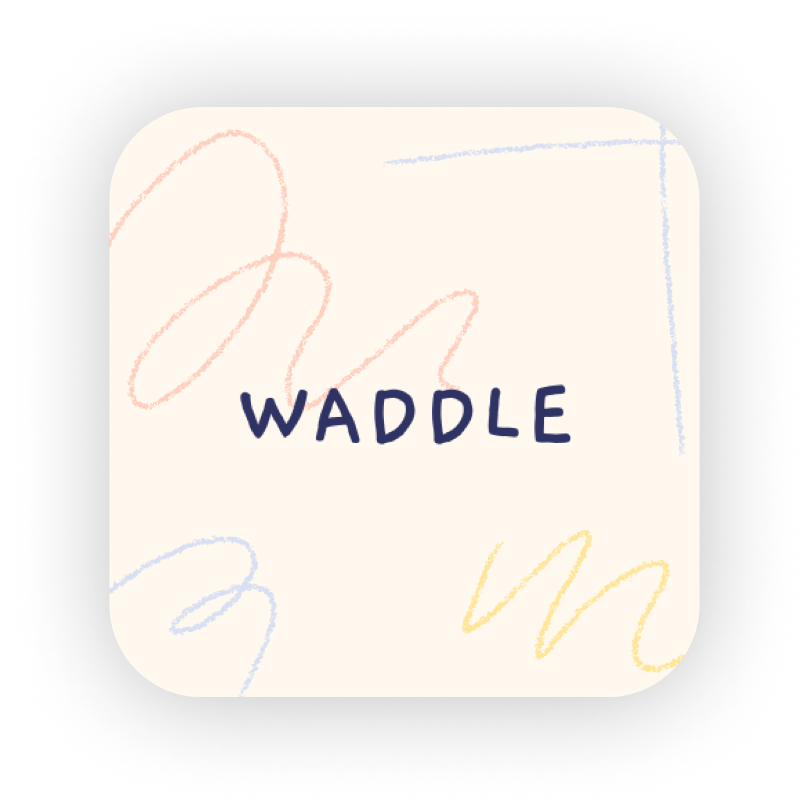

<!-- PROJECT LOGO -->
<br />


[![LinkedIn][linkedin-shield]][linkedin-url]
[![Instagram][instagram-shield]][instagram-url]

<h6 align="center">Isla Just 200080 iOS 303</h6>
<p align="center">
</br>
   
   <p align="center">
  <a href="https://github.com/isla-just/BigBucks ">
    
  </a>
  </p>
  
  <h3 align="center">Big Bucks</h3>

  <p align="center">
    pocket money management for kids. Teaching children how to manage their money effectively<br>
      <a href="https://github.com/isla-just/BigBucks"><strong>Explore the docs »</strong></a>
      <br />
      <br />
      <a href="ReadMeImg/IslaJust_200080_DV300_T1_demo.mp4">View Demo</a>
       ·
       <a href="https://github.com/isla-just/BigBucks/issues">Report Bug</a>
       ·
       <a href="https://github.com/isla-just/BigBucks/issues">Request Feature</a>
   </p>

<!-- TABLE OF CONTENTS -->
## Table of Contents

* [About the Project](#about-the-project)
  * [Project Description](#project-description)
  * [Built with](#built-with)
* [Getting Started](#getting-started)
  * [Prerequisites](#prerequisites)
  * [Installation](#installation)
* [Features and Functionality](#features-and-functionality)
   * [Features](#features)
   * [Functionality](#functionality)
* [Concept Process](#concept-process)
   * [Wireframes](#wireframes)
   * [User-flow](#user-flow)
* [Development Process](#development-process)
   * [Implementation Process](#implementation-process)
        * [Highlights](#highlights)
        * [Challenges](#challenges)
   * [Reviews and Testing](#reviews-and-testing)
        * [Unit Testing](#unit-testing)
   * [Future Implementation](#future-implementation)
* [Final Outcome](#final-outcome)
   * [Mockups](#mockups)
   * [Video Demonstration](#video-demonstration)
   * [Promotional Video](#promotional-video)
* [Roadmap](#roadmap)
* [Contributing](#contributing)
* [License](#license)
* [Contact](#contact)
* [Acknowledgements](#acknowledgements)

<!--PROJECT DESCRIPTION-->
## About the Project

![image1][image1]

### Project Description

An iOS application that helps kids manage their monthly pocket money spending. Parents are able to set up their account with a parental pin and set their pocket money. Then kids can log the spending of their pocket money on the app and it is reflected on their Big Bucks card. They can even use the in-app calculator to see if they will have enough Big Bucks for their next purchase. This teaches kids how to manage their money effectively throughout the month - a very valuable skill

### Built With

* [XCode](https://developer.apple.com/xcode/)
* [SwiftUI](https://developer.apple.com/xcode/swiftui/)


<!-- GETTING STARTED -->
## Getting Started

These instructions will get you a copy of the project up and running on your local machine for development and testing purposes.

### Prerequisites

For development XCode is required which can be downloaded from [here](https://apps.apple.com/us/app/xcode/id497799835?mt=12)

### Installation
 
1. Clone the repo
```sh
git clone https://github.com/isla-just/BigBucks.git
```
2. Locate the file and open it in XCode

3. Chose any simulator you'd like to use and press the play button to run the app

<!-- FEATURES AND FUNCTIONALITY-->
## Features and Functionality

### Features

### Immersive onboarding experience

![image2][image2]

Interact with the liquid onboarding screens as you learn about the app

### Login, Signup and account customisation

![image4][image4]

Login to your account or create a new account and complete the parental setup to set pocket money amount and the parental pin

### Dashboard page

![image3][image3]

View your dynamic card balance and a list of your monthly spending   

### Filter and search

Filter and search through spending categories to refine results

### Detailed view

![image5][image5]

See a detailed view of the spend details, date and notes

### In-app calculator

![image6][image6]

See if you'll have enough big bucks for your next purchase with the in-app calculator

### Settings page

![image7][image7]

View app and delevoper details

### Appearances

![image8][image8]

Change to an alternative appearance where all the colours and imagery changes

### Functionality

* `Calculate` using the in app calculator
* `Search and filter` spends within the application
* View your `balance` on your digital card
* Change the `appearance` of your app


<!-- CONCEPT PROCESS -->
## Concept Process

The `Conceptual Process` is the set of actions, activities and research that was done when starting this project.

### Initial designs

![image9][image9]

### User-flow

![image10][image10]

<!-- DEVELOPMENT PROCESS -->
## Development Process


The `Development Process` is the technical implementations and functionality done in the backend of the application.

### Implementation Process

#### Onboarding sequence
I started by setting up my project and my Github and then started following a tutorial I found on the liquid onboarding sequence

#### Frontend development
Then I focussed on implementing my designs using SwiftUI. I spent some time learning about layouts, grids and UI elements available on the platform

#### Navigation
After realising how simple it is to navigate to pages and understanding how Swift navigation bars and tabs work, I was able to implement them in my project.

#### Mapping and filtering
Next, I focussed on how I was going to structure my data. I then mapped it on the frontend and implemented the searching and filtering functionality

#### App storage 
Lastly, I did the settings page and set up the alternative appearance of my app. I implemented data storage for light mode and dark mode and on the onboarding screenality

### Highlights

* I really enjoyed how simple it is to create really beautiful frontends using SwiftUI. I also really enjoyed setting up the alternative appearance of my app and seeing everything come together. I also loved the concept ideation for this project

#### Challenges

* Initially I struggled with layouts and grids but after getting the hang of it it was super easy. I also struggled coming up with an initial idea that fit the brief but I am so happy with the one that I chose.


#### Future Implementation

* Actually adding a new spend in the future
* adding charts and graphs to visualise changes
* a piggy bank feature to put money aside

<!-- MOCKUPS -->
## Final Outcome

### Mockups

![image11][image11]

<!-- VIDEO DEMONSTRATION -->
## Video Demonstration

To see a run through of the application, click below:

[View Demonstration]()

<!-- PROMO VIDEO -->
## Promotional Video

To see the promotional video, click below:

[View Promotional Video]()

<!-- ROADMAP -->
## Roadmap

See the [open issues](https://github.com/isla-just/BigBucks/issues) for a list of proposed features (and known issues).

<!-- CONTRIBUTING -->
## Contributing

Contributions are what make the open source community such an amazing place to be learn, inspire, and create. Any contributions you make are **greatly appreciated**.

1. Fork the Project
2. Create your Feature Branch (`git checkout -b feature/AmazingFeature`)
3. Commit your Changes (`git commit -m 'Add some AmazingFeature'`)
4. Push to the Branch (`git push origin feature/AmazingFeature`)
5. Open a Pull Request

<!-- AUTHORS -->
## Authors

* **Isla Just** - [IslaJust](https://github.com/isla-just)

<!-- LICENSE -->
## License

Distributed under the MIT License. See `LICENSE` for more information.\

<!-- LICENSE -->
## Contact

* **Isla Just** - [@byislajust](https://www.instagram.com/byislajust/) - isla@just.co.za
* **Project Link** - https://github.com/isla-just/BigBucks

<!-- ACKNOWLEDGEMENTS -->
## Acknowledgements

* [Kavsoft Swift tutorials](https://www.youtube.com/c/Kavsoft)
* [CodeWithChris](https://www.youtube.com/c/CodeWithChris)
* [Liquid swipe tutorial 1](https://iosexample.com/animated-ios-app-onboarding-screens-with-liquid-swipe-animation-using-swiftui/)
* [Liquid swipe tutorial 2](https://www.youtube.com/watch?v=BQrrNpgDbEg)
* [Calculator tutorial](https://www.youtube.com/watch?v=uWNP1WM9zHA)

mockups:
* https://originalmockups.com/mockups/free-mockups
* https://freedesignresources.net/category/free-mockups/?_paged=6
* https://www.anthonyboyd.graphics/mockups/28/

* lecturer: Armand Pretorius https://github.com/ArmandPret

[linkedin-shield]: https://img.shields.io/badge/-LinkedIn-black.svg?style=flat-square&logo=linkedin&colorB=555
[linkedin-url]: https://www.linkedin.com/in/isla-just-b038a2202
[instagram-shield]: https://img.shields.io/badge/-Instagram-black.svg?style=flat-square&logo=instagram&colorB=555
[instagram-url]: https://www.instagram.com/dylandasilva.designs/

<!-- MARKDOWN LINKS & IMAGES -->
[image1]: ReadMeImg/slide1.png
[image2]: ReadMeImg/slide2.png
[image3]: ReadMeImg/slide3.png
[image4]: ReadMeImg/slide4.png
[image5]: ReadMeImg/slide5.png
[image6]: ReadMeImg/slide6.png
[image7]: ReadMeImg/slide7.png
[image8]: ReadMeImg/slide8.png
[image9]: ReadMeImg/slide9.png
[image10]: ReadMeImg/slide10.png
[image11]: ReadMeImg/slide11.png
[image12]: ReadMeImg/slide12.png

[image15]: ReadMeImg/devmockup1.png

 
